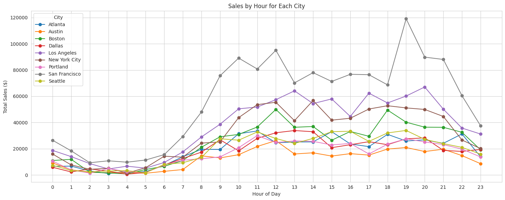
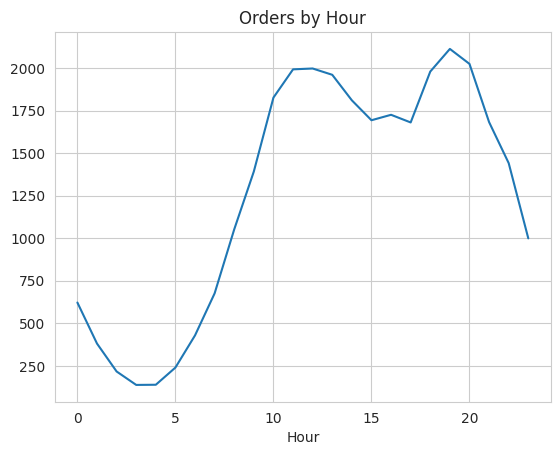
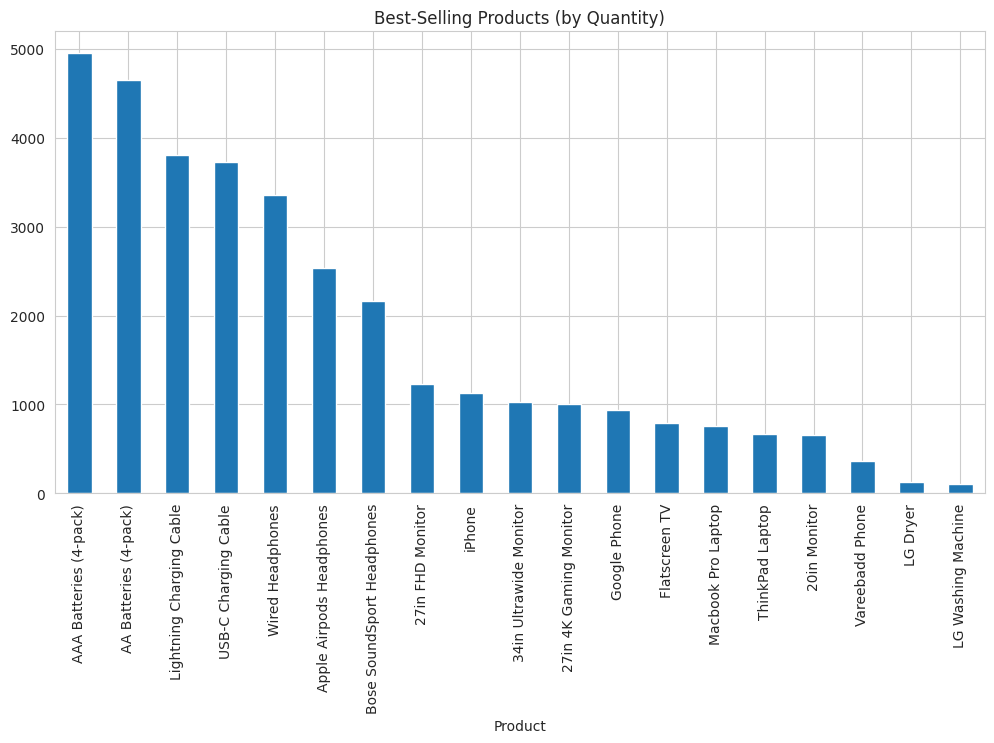
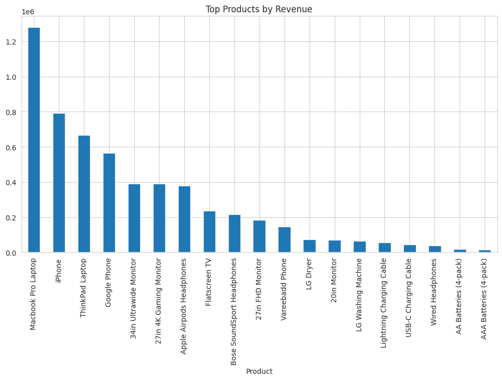

# Sales Analysis Report
# Description : 
* Data cleaning: Ensured proper data types (e.g., dates, decimals) , and cleaning data .
* Data modeling: Filtered and structured sales data by product, revenue, and time.
* Business analysis: Generated actionable recommendations.
* Python (Pandas, Matplotlib, Seaborn).
* Google collab.

# objective
This project analyzes 12 months of sales data to identify:
- Top-country sales.
- Top-hours orders.
- Best-selling products.
- Top-performing months.

# 1. Analysis of Sales by Hour and City 

 **Top Performing City** 
* **San Francisco** clearly outperforms all other cities in total sales throughout the day. Its sales peak dramatically around **(7 PM)**, reaching close to **120,000**, which is more than double most other cities.

**Peak Sales Hours**
* Across **most cities**, sales start increasing around **8:00 AM**, gradually rising during the day.
* The highest sales activity generally occurs between **10:00 AM and 8:00 PM**, with sharp peaks in the late afternoon and early evening.

 **Low Activity Hours**
* Between **1:00 AM and 6:00 AM**, all cities show minimal sales. This is likely due to people being asleep or not engaging in online shopping during these hours.

**City Comparisons**
* **Los Angeles** and **New York City** follow behind San Francisco, showing strong sales in the same time (10 AM to 8 PM).
* **Austin, Portland, and Seattle** have the **lowest total sales**, and their peaks are much smaller.

**Interpretation**
* The **high activity in the evening (15:00–20:00)** suggests that people likely shop after work when they are at home.
* San Francisco’s dominance may reflect to : 
  * A larger or more tech-savvy customer base ( the dataset is a tech data ).
  * Greater disposable income.
  * Possibly more marketing or brand presence in that city.
    
**Recommendations Based on Sales by Hour and City**
 **Focus Marketing Efforts on Peak Hours (15:00–20:00)**
* Run targeted ads, push notifications, and email campaigns between **3 PM and 8 PM**, when most users are actively purchasing.
* Use countdown promotions or limited-time offers during this window to create urgency.

**Prioritize High-Performing Cities like San Francisco**
* Increase inventory availability and delivery options in **San Francisco**, where demand is strongest.
* Consider **location-based promotions** for other top cities like **Los Angeles** and **New York City**.

**Boost Visibility in Underperforming Cities**
* For cities with low sales (e.g., **Austin, Portland, Seattle**), explore localized marketing strategies:
  * Collaborate with local influencers.
  * Offer city-specific discounts.
  * Translate ads or tailor messaging if needed.

**Optimize Website/App Performance in Evenings**
* Ensure the platform performs smoothly between **15:00 and 21:00**, as high traffic could slow down load times or cause errors, especially in key markets like San Francisco.
* Add a live chat or customer support team during these hours.

**Promote Products Suited for Evenings**
* Feature products often bought in the evening (e.g., home appliances, entertainment devices, phones).
* Showcase “Work-from-home” or “Evening Relaxation” bundles.

# 2. Orger by Hour 

**Low Activity (0:00–6:00 AM):**
 * Orders are very low, especially between 2 AM and 5 AM (the lowest point).
  * This is expected as most users are likely inactive during these hours.

** Increase (6:00–10:00 AM):**
  * Orders start rising sharply from 6 AM and peak around 10–11 AM.
  * This suggests that users become active in the morning, possibly during work hours or while planning their day.

**Midday Plateau (11:00 AM–1:00 PM):**
  * Orders remain high and stable during this period — possibly lunchtime usage.

**Afternoon Dip (1:00–4:00 PM):**
  * There's a noticeable decline in orders during early afternoon.

**Evening Peak (5:00–9:00 PM):**
  * Orders rise again and **peak at around 8 PM**, indicating a strong preference for evening activity — likely after work hours.

**Late-Night Decline (9:00 PM–11:00 PM):**
  * After 9 PM, there's a steady decline in order volume.

#  **Recommendations:**
 **Marketing & Promotions:**
 **Focus promotions and ads between 9 AM–1 PM** and **5 PM–9 PM**, when user activity is highest.
* Avoid running ads/promotions during early morning (2–5 AM) when activity is lowest.

 **Operational Planning:**
* *Staff customer service teams more heavily during peak hours**, especially 10 AM–1 PM and 6 PM–9 PM.
* Reduce staffing or automate services during the early morning hours.

**Inventory & System Readiness:**
* Ensure high-demand products or services are well-stocked and system performance is optimized before the **morning and evening spikes**.

 **A/B Testing Campaigns:**
* Test different messaging or product placements during **midday dip (2 PM–4 PM)** to try  improving engagement during this slower period.

 **Push Notifications or Emails:**
* Schedule **email/push notifications** slightly **before** the peak times (e.g., 8 AM and 4:30 PM) to catch users before they start ordering.

# 3. Most Sold Products

Top 5 by Units Sold:
 * AAA Batteries (4-pack)
 * AA Batteries (4-pack)
 * Lightning Charging Cable
 * USB-C Charging Cable
 * Wired Headphones
These are low-cost, high-demand items. and everyday essentials. They're sold in very high volume, but they don’t contribute much to revenue, and they dominate due to their frequent need and affordability.

Mid-Tier Sellers:
 * Wired Headphones, Apple Airpods Headphones, Bose Soundsport Headphones
 * Monitors (27in FHD, Ultrawide, Gaming)
 * Smartphones (iPhone, Google Phone)
These are consumer electronics that combine functionality and moderate cost. They show strong but not top-tier sales.

Lower Sales Products:
 * Laptops(Macbook Pro, ThinkPad)
 * Flat-screen TVs
 * Large Appliances: LG Dryer, LG Washing Machine
 * 20in Monitor, Vareebadd Phone
These products are higher in price and purchased less frequently,lower unit sales.

#  Recommendations:
* Keep **large inventory** of top-selling essentials like batteries and charging cables.
* Bundle them (e.g., offer a battery + cable combo) for upselling.
* Promote **mid-tier products** (headphones, monitors) during seasonal sales or tech events. These have high potential for conversion.
* Consider **accessory bundling** (e.g., headphones + phone).
* Though low in quantity, laptops and washing machines likely yield **higher margins**.
* Consider targeted marketing or **installment plans** to encourage purchase.
* Review why items like the **Vareebadd Phone** or **LG Washing Machine** are underperforming, like : Poor reviews , Expensive or Not well marketed?
* You might consider:
       * Discontinuing these products
       * Offering discounts
       * Improving product visibility

# 4. top revenue product sales

Top 5 by Revenue:
 * MacBook Pro Laptop
 * iPhone
 * ThinkPad Laptop
 * Google Phone
 * 34in Ultrawide Monitor
These are high-cost, low-volume items. Even if sold less often, their high price makes them the biggest revenue generators.

# Strategic Recommendations
* Don’t focus only on top-selling items like cables and batteries. Prioritize revenue-rich products (e.g., laptops, phones) in marketing and product placement.
* Combine low-revenue, high-volume items with high-margin ones , example: Bundle MacBook Pro + USB-C cable + Headphones.
* While selling budget items (batteries/cables), use recommendation engines or ads to upsell phones, headphones, and laptops.
* Stock large quantities of fast-moving items (batteries, cables).
* Maintain strategic inventory of big-ticket items, ensuring availability without overstocking.
* Push mid-tier crossover products like: Apple AirPods, Bose, Headphones , Monitors . These show strong performance both in units sold and revenue.
* Products like LG Washing Machine, Wired Headphones, AA/AAA batteries show low revenue despite high volume. Look into: Pricing strategies , Supplier negotiations . Possible discontinuation or improved positioning.

# 5. Top Performing Mounth 

* High Performance in April
April is your peak month. This might be due to:
Seasonal promotions
New product launches
End-of-quarter deals
Holidays like Easter sales

#  Recommendations
1. Review what promotions, products, or events drove April's success.
2.Replicate or expand April campaigns in other months.
3. Consider Back-to-School promotions in August.
4.Use flash sales or email remarketing to re-engage customers.
5.Might need more stock and staff in April and possibly reduce in slow months.

